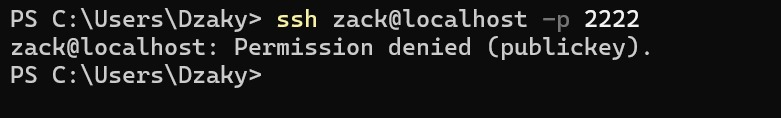

Project 1 — Secure Linux Server Hardening

1\. Summary

This repository contains Project 1: Secure Linux Server Hardening,  

a comprehensive configuration exercise focused on strengthening the security posture of a Linux server.  

The project includes the implementation and verification of multiple security layers such as:

\- SSH Hardening  

\- UFW Firewall Configuration  

\- Fail2Ban Intrusion Prevention  

\- Auditd System Activity Auditing  

\- RKHunter Rootkit Analysis  

\- OS Kernel \& Service Hardening  

\- Automated Backup System  

\- Logging \& Monitoring Enhancements

---

2\. Objective / Use Case

The primary objective of this project is:

\- To build a secure, production-grade Linux server baseline  

\- To demonstrate practical SysAdmin \& DevOps hardening skills  

\- To simulate a realistic corporate server deployment  

\- To enforce access control, auditing, monitoring, and backup policies  

\- To produce documentation suitable for job portfolios or university reports

This project reflects the security requirements commonly found in enterprise environments, including:

\- Prevent unauthorized access  

\- Mitigate brute-force attacks  

\- Enforce least-privilege and logging  

\- Detect potential intrusions  

\- Preserve data through automated backup  

---

3\. Architecture / Flow Diagram

project-1-secure-server/screenshots/diagram.png

---

4\. Features Implemented / Final Output

\- Secure SSH access using ED25519 key pairs  

\- Firewall rules to restrict traffic  

\- Fail2Ban jail for SSH brute-force blocking  

\- Auditd rules to track privileged or sensitive actions  

\- RKHunter scan to detect rootkits or system anomalies  

\- OS Hardening via sysctl and service minimization  

\- Automated daily backup via cron + rsync    

---

5\. Implementation Steps

This section provides a structured overview of all configurations performed.

---

Step 1 — SSH Hardening

Strengthen remote access security using key-based authentication.

1\. Generated ED25519 SSH key pair on the host machine  

In client
Use command : ssh-keygen -t ed25519 -C "yourname"

2\. Created `.ssh` directory and configured secure permissions  

`mkdir -p ~/.ssh`
`chmod 700  ~/.ssh`

3\. Added public key to `authorized\_keys` on the server  

`nano ~/.ssh/authorized_keys -> paste public key client's here
chmod 600 ~/.ssh/authorized_keys`

4\. Hardened `sshd\_config`  

&nbsp;  - Disabled password login  

&nbsp;  - Disabled root login  

&nbsp;  - Enabled public-key-only authentication  

&nbsp;  → `screenshots/sshd-config.png`

5\. Tested SSH login using key-based authentication  
If public key true :

&nbsp;  → 

If public key false

&nbsp;  → 

Final Output: Secure SSH access (key-only, hardened daemon).

---

Step 2 — UFW Firewall Configuration

Restrict network traffic to essential services only.

1\. Enabled UFW firewall  

2\. Allowed required ports (22, 80, 443 if applicable)  

3\. Denied all other incoming connections  

4\. Verified active rule set

→ \*(Screenshot:)\* `screenshots/ufw-rules.png`

Final Output: Host-level firewall enforcing minimal attack surface.

---

Step 3 — Fail2Ban Intrusion Prevention

Block repeated SSH brute-force attempts automatically.

1\. Installed Fail2Ban  

2\. Created `jail.local` for SSH protection  

3\. Applied ban timers, retry limits, and custom log paths  

4\. Verified jail status  

5\. Simulated failed SSH attempts to ensure ban mechanism works

→ `screenshots/fail2ban-status.png`

Final Output: Automatic IP banning for brute-force protection.

---

Step 4 — Auditd System Activity Monitoring

Track sensitive operations and privileged command execution.

1\. Installed Auditd  

2\. Enabled service and verified logging  

3\. Added custom audit rules  

4\. Triggered test events (sudo, file read, etc.)  

5\. Viewed logs using `ausearch` and `aureport`

→ `screenshots/auditd-events.png`

\*\*Final Output:\*\* Complete logging of system-level and privileged activities.

---

Step 5 — RKHunter Rootkit Analysis

Detect known rootkits, anomalies, and suspicious binaries.

1\. Installed RKHunter  

2\. Updated database  

3\. Performed initial baseline (`--propupd`)  

4\. Ran full system scan  

5\. Reviewed system check summary

→ `screenshots/rkhunter-scan.png`

Final Output: Verified system integrity against known threats.

---

Step 6 — OS \& Kernel Hardening

Reduce the kernel attack surface and disable unused services.

1\. Disabled unnecessary daemons  

2\. Applied secure sysctl parameters (ASLR, rp\_filter, no redirects, etc.)  

3\. Reloaded kernel parameters  

4\. Verified active system settings

→ `screenshots/sysctl-hardening.png`

Final Output: Hardened operating system and network stack.

---

Step 7 — Backup Automation

Daily automated home directory backup using cron + rsync.

1\. Created `/backup` directory  

2\. Wrote `backup.sh` script with timestamped backup logic  

3\. Granted executable permissions  

4\. Logged backup events  

5\. Added cron job for daily execution

→ `screenshots/backup-created.png`  

→ `screenshots/cron-job.png`

\*\*Final Output:\*\* Automated, timestamped, logged backup system.

